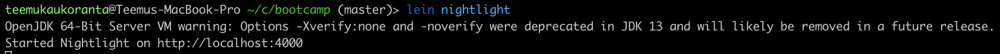
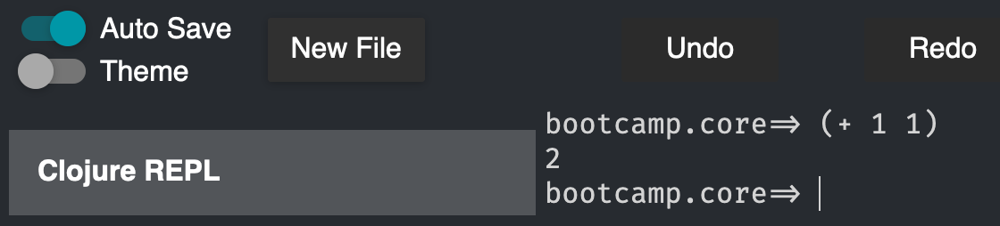
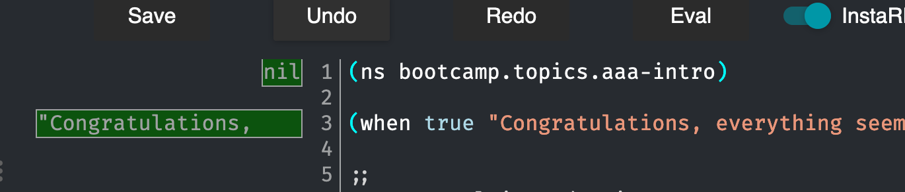

# bootcamp-tasks

A project containing bootcamp lessons and exercises

## Getting started

### Prerequisites

You need:

* Laptop with Linux, Mac OS X, or recent Windows

Note, if you have Linux or Mac, you can install these using your package
manager. In case of Mac, use [Homebrew](http://brew.sh).

* Clojure command line tools: https://clojure.org/guides/getting_started
* JDK 1.8 _(or later)_: https://www.azul.com/downloads/zulu-community/?package=jdk
* Leiningen 2.5.0 _(or later)_: http://leiningen.org
* git: http://git-scm.com/book/en/v2/Getting-Started-Installing-Git
* IDE with Clojure support (more details below)

### Check that everything works

Run `lein nightlight` in the project's root folder. You should see something like this:

Open your browser and navigate to `localhost:4000`. You should see the Nightlight editor environment.

Open the Clojure REPL tab on the right, and type `(+ 1 1)` into the REPL. You should get a result.

From the right side menu, navigate to src/bootcamp/topics/aaa_intro.clj. Click on InstaREPL at the top of the editor.
You should see something like this:

You may continue with setting up your IDE if you wish, but only Nightlight is required for the first part of training.

## Setup your IDE

### General

The development process for Clojure is radically different from Java
development process. Likewise, the features that you'll want from your
IDE are also different.

The important features that you should look for in Clojure IDE are:

* REPL, the IDE should allow access to project REPL
* Evaluating from source, you should be able to select part of source
  code and send it to REPL for evaluation
  
The [State of Clojure survey for 2020](https://clojure.org/news/2020/02/20/state-of-clojure-2020#_deep_dives)
found the most popular editors to be Emacs+Cider and IDEA+Cursive. If you're familiar with Emacs (or vim),
you can use those. If not, consider IDEA+Cursive, or VS Code+Calva if you want a free and open source editor environment.

### IntelliJ IDEA with Cursive

Follow the instructions for installing Cursive in
here https://cursiveclojure.com/userguide/

Import the project as described in this page
https://cursiveclojure.com/userguide/leiningen.html

### Visual Studio Code with Calva

Microsoft Visual Studio Code has [Calva][calva] plugin for Clojure code.  The
plugin can be installed through the Visual Studio Marketplace (just click the
"Extensions" icon and search for "Calva").

[calva]: https://marketplace.visualstudio.com/items?itemName=cospaia.clojure4vscode
[calva-github]: https://github.com/BetterThanTomorrow/calva

### Vim

See https://gist.github.com/Deraen/da73db508e75eb4aad71 for list of few
useful plugins and settings.

### Emacs

See https://github.com/clojure-emacs/cider

## License

Copyright © 2021 Metosin

This program and the accompanying materials are made available under the
terms of the Eclipse Public License 2.0 which is available at
http://www.eclipse.org/legal/epl-2.0.

This Source Code may also be made available under the following Secondary
Licenses when the conditions for such availability set forth in the Eclipse
Public License, v. 2.0 are satisfied: GNU General Public License as published by
the Free Software Foundation, either version 2 of the License, or (at your
option) any later version, with the GNU Classpath Exception which is available
at https://www.gnu.org/software/classpath/license.html.
